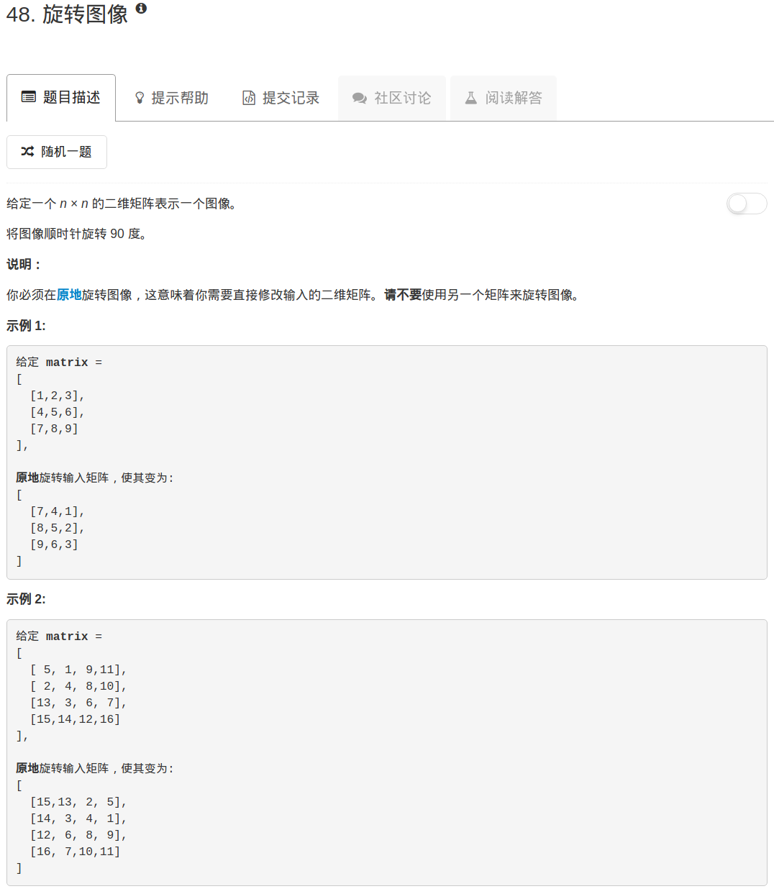

```python
import copy
class Solution:
    def rotate(self, matrix):
        """
        :type matrix: List[List[int]]
        :rtype: void Do not return anything, modify matrix in-place instead.
        """
        if not matrix: return matrix
        n = len(matrix)
        MAT = copy.deepcopy(matrix)
        
        for ii in range(n):
            for jj in range(n):
                matrix[ii][jj] = MAT[n-jj-1][ii]
```

