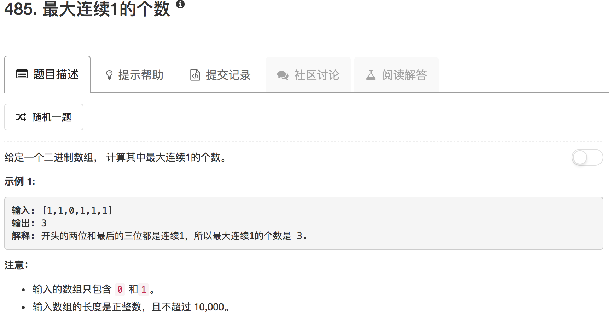

```python
class Solution(object):
    def findMaxConsecutiveOnes(self, nums):
        """
        :type nums: List[int]
        :rtype: int
        """
        if not nums: return None
        
        ans = 1
        count = 0
        maxcount = 0
        for ii in range(len(nums)):
            ans = ans & nums[ii]
            if ans == 0:
                ans = 1
                count = 0
            else:
                count = count + 1
            if count > maxcount:
                maxcount = count
        return maxcount
```

