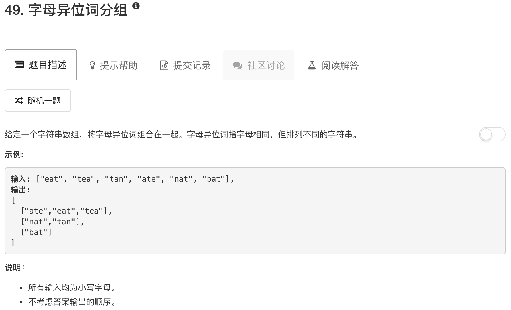

```python
class Solution(object):
    def groupAnagrams(self, strs):
        """
        :type strs: List[str]
        :rtype: List[List[str]]
        """
        table = {}
        ans = []
        for word in strs:
            tmp = list(word)
            tmp.sort()
            tmp = "".join(tmp)
            if tmp in table:
                table[tmp].append(word)
            else:
                table[tmp] = [word]
        for key in table:
            ans.append(table[key])
        return ans
```

