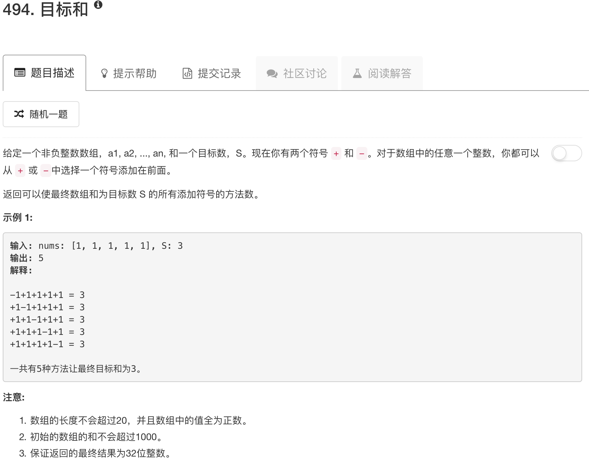

做的动态规划的第一题。因为对动态规划还不熟悉，所以记录一些理解。

其实这道题有一些数学规律在其中，比如：

正数与负数绝对值之和为数组和

正数与负数和为目标和

因此，正数与负数绝对值之和一定为偶数

另外，如果数组和小于目标和，则无解

问题转化为求解子数组和等于目标和

给定集合nums={1,2,3,4,5}, 求解子集，使子集中元素之和等于9 

定义dp[10]数组, dp[10] = {1,0,0,0,0,0,0,0,0,0}

dp[i]表示子集合元素之和等于当前目标值i的方案个数, 当前目标值i等于9减去当前元素值n

当前元素等于1时，dp[9] = dp[9] + dp[9-1]，dp[8] = dp[8] + dp[8-1]。。。dp[1] = dp[1] + dp[1-1]

当前元素等于2时，dp[9] = dp[9] + dp[9-2]，dp[8] = dp[8] + dp[8-2]。。。dp[2] = dp[2] + dp[2-2]

。。。

当前元素等于5时，。。。dp[5] = dp[5] + dp[5-5]

所以注意这里实际上就是累积，数组重复利用了

状态转移方程可以表达为：dp[i] = dp[i] + dp[i-n]

当然，这是一种简化的动态规划。原始的动态规划比较复杂，实际上是这样的：

令dp\[i][j]表示前i个数的和为j的方案的个数，同时给定的数组为a，那么状态转移方程如下：

dp\[i][j]=dp\[i−1][j−a[i]]+dp\[i−1][j+a[i]]

```python
class Solution(object):
    def findTargetSumWays(self, nums, S):
        """
        :type nums: List[int]
        :type S: int
        :rtype: int
        """
        if sum(nums) < S: return 0
        if (sum(nums)+S) % 2 == 1: return 0
        goal = (sum(nums)+S)/2
        dp = [0] * (goal+1)
        dp[0] = 1
        for num in nums:
            target = goal
            while target >= num:
                dp[target] = dp[target] + dp[target - num]
                target = target - 1
        return dp[goal]
```


 