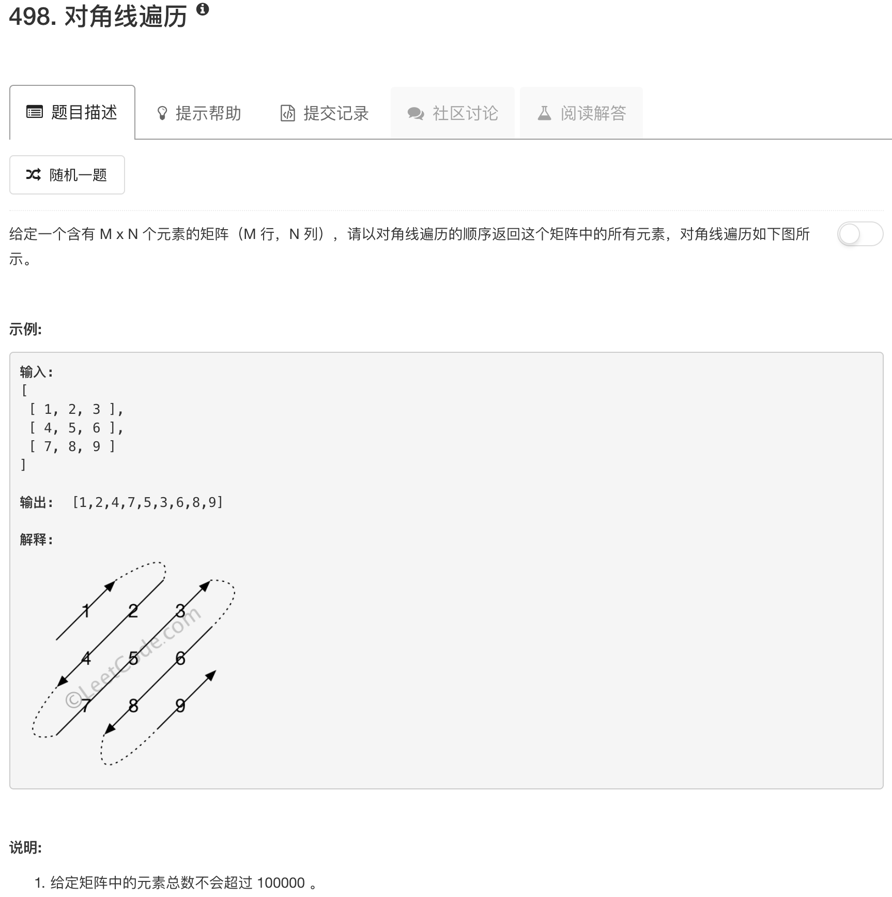

```python
class Solution(object):
    def findDiagonalOrder(self, matrix):
        """
        :type matrix: List[List[int]]
        :rtype: List[int]
        """
        if not matrix: return matrix
        dirs = [[-1,1],[1,-1]]
        nrows = len(matrix)
        ncols = len(matrix[0])
        
        xi, yi = [0,0]
        ans = []
        dirflag = 0
        
        for ii in range(nrows*ncols):
            
            ans.append(matrix[xi][yi])
        
            xx, yy = dirs[dirflag]
            
            xi, yi = xi + xx, yi+yy
            
            if yi >= ncols:
                yi = ncols - 1
                xi = xi + 2 
                dirflag = 1 - dirflag
                
            if xi < 0:
                xi = 0
                dirflag = 1 - dirflag
            
            if xi >= nrows:
                xi = nrows - 1
                yi = yi + 2
                dirflag = 1 - dirflag
            
            if yi < 0:
                yi = 0
                dirflag = 1 - dirflag
     
        return ans
```

