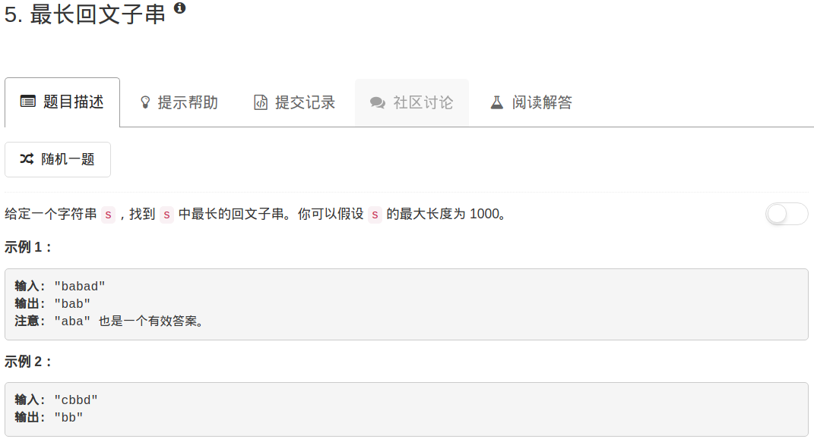

```python
class Solution:
    def longestPalindrome(self, s):
        """
        :type s: str
        :rtype: str
        """
        # 作为练习，同时求解最长字串的长度和最长字串是哪个
        n = len(s)
        #dp = [[0 for x in range(n)] for y in range(n)]       # 这个数组放的是长度
        dp1 = [[False for x in range(n)] for y in range(n)]  # 这个数组放的是从i到j是否符合条件
        left,right = 0,0
        for ii in range(n-2,-1,-1):
            #dp[ii][ii] = 1
            dp1[ii][ii] = True
            for jj in range(ii+1,n,1):
                #dp[ii][jj] = dp[ii+1][jj-1]+2 if s[ii] == s[jj] else max(dp[ii+1][jj],dp[ii][jj-1])
                dp1[ii][jj] = s[ii] == s[jj] and (dp1[ii+1][jj-1] or jj-ii<3)
                if dp1[ii][jj] and right-left<jj-ii: right, left = jj, ii                         
        return s[left:right+1]
```

这里借机回顾下动态规划

假设dp\[ii][jj]存储的是长度jj-ii的字串，最长的回文字串长度。那么，如果s[ii]==s[jj]，则长度jj-ii-2的串也是回文。这样状态转移方程就出来了：

```
dp[ii][jj]
```

如果s[ii]！=s[jj]：

```
dp[ii][jj] = max(dp[ii+1][jj],dp[ii][jj-1])
```

意思就是，当左右两端的字符不一样的时候，那么就取去掉一个字符后两者中的大者

如果要具体得到最长的字串，那么只要记录jj和ii差最大的ii和jj就行了