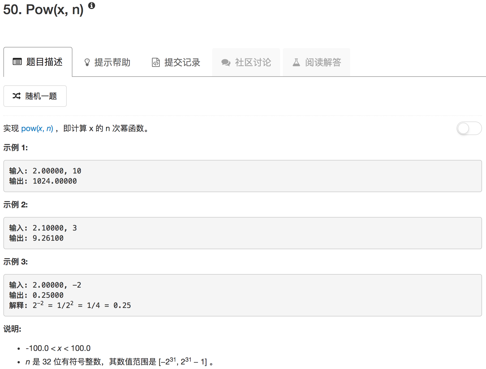

```python
class Solution(object):
    def myPow(self, x, n):
        """
        :type x: float
        :type n: int
        :rtype: float
        """
        if n == 0:
            return 1.0
        if n < 0:
            return 1.0 / self.myPow(x, -n)
        if n == 1:
            return x
        return self.myPow(x*x, n//2) if n % 2 == 0 else x * self.myPow(x*x, n//2)
```

