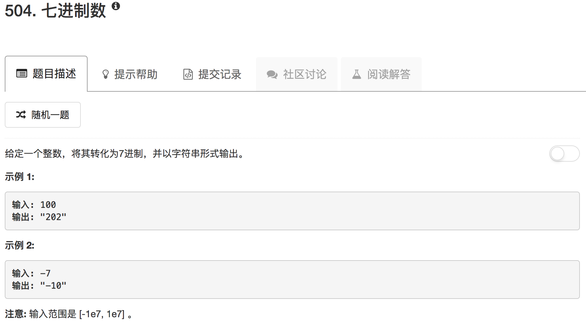

```python
class Solution(object):
    def convertToBase7(self, num):
        """
        :type num: int
        :rtype: str
        """
        flag = False
        if num < 0:
            num = -num
            flag = True
        ans = 0
        count = 0
        while num:
            div, res = divmod(num, 7)
            ans = ans + res * 10**count
            num = div
            count = count + 1
        if flag: ans = -ans
        return str(ans)
```

