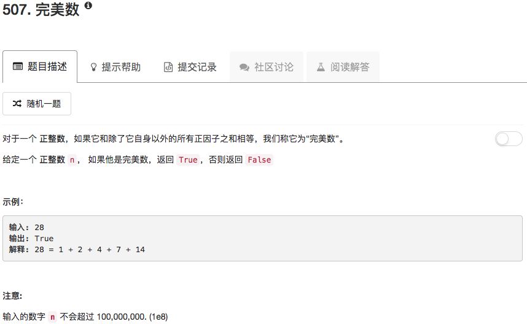

```python
class Solution(object):
    def checkPerfectNumber(self, num):
        """
        :type num: int
        :rtype: bool
        """
        sum = 1
        if num < 0 or num == 1: return False
        import math
        for ii in range(2,int(math.sqrt(num))+1):
            if num % ii == 0:
                sum = sum + ii + num / ii
        return True if num == sum else False
```