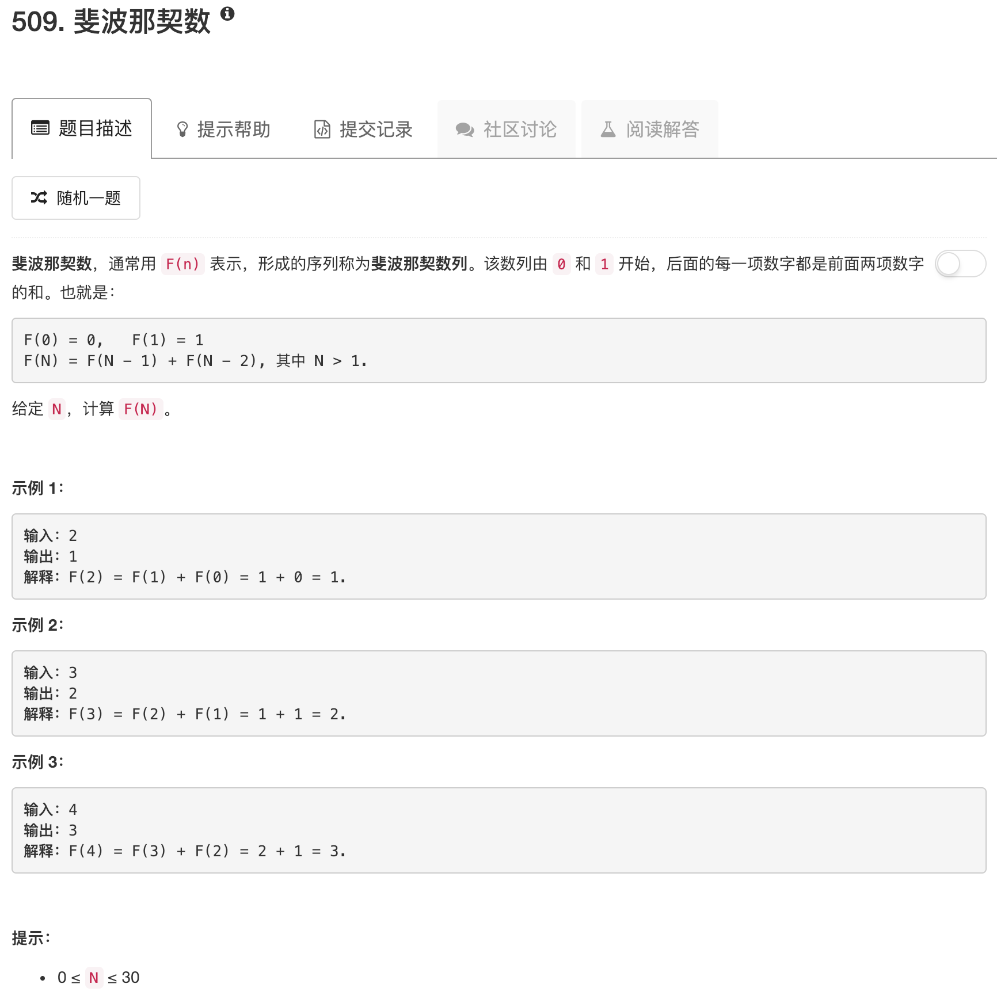

```python
class Solution:
    def fib(self, N):
        """
        :type N: int
        :rtype: int
        """
        if N == 0: return 0
        if N == 1: return 1
        
        dp = [0 for ii in range(N+1)]
        dp[0] = 0
        dp[1] = 1
        
        for ii in range(2,N+1):
            dp[ii] = dp[ii-1] + dp[ii-2]
        return dp[N]
```

