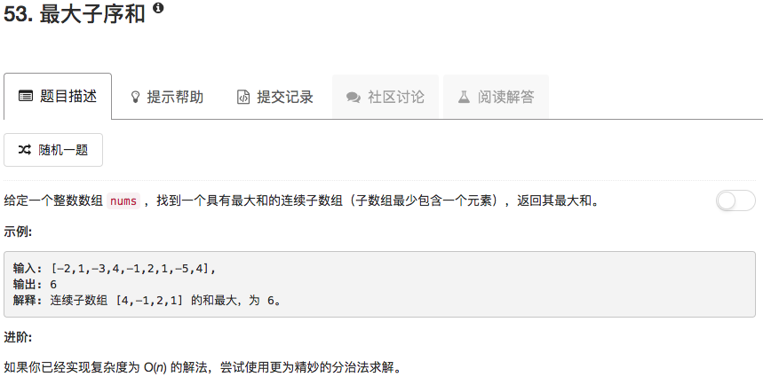

```python
class Solution(object):
    def crossMax(self, nums, left, mid, right):
        sum = 0
        leftmax = -float('inf')
        for ii in range(mid, left-1, -1):
            sum = sum + nums[ii]
            if sum >= leftmax: leftmax = sum
        
        sum = 0
        rightmax = -float('inf')
        for ii in range(mid+1,right+1):
            sum = sum + nums[ii]
            if sum >= rightmax: rightmax = sum
                
        return leftmax+rightmax
        
    def findMax(self, nums, low, high):
        if low == high:
            return nums[low]
        mid = (low+high)//2
        leftmax = self.findMax(nums, low, mid)
        rightmax = self.findMax(nums, mid+1, high)
        crossmax = self.crossMax(nums, low, mid, high)
        if leftmax >= rightmax and leftmax >= crossmax:
            return leftmax
        elif rightmax >= leftmax and rightmax >= crossmax:
            return rightmax
        else:
            return crossmax
    
    def maxSubArray(self, nums):
        """
        :type nums: List[int]
        :rtype: int
        """
        return self.findMax(nums,0,len(nums)-1)
```

