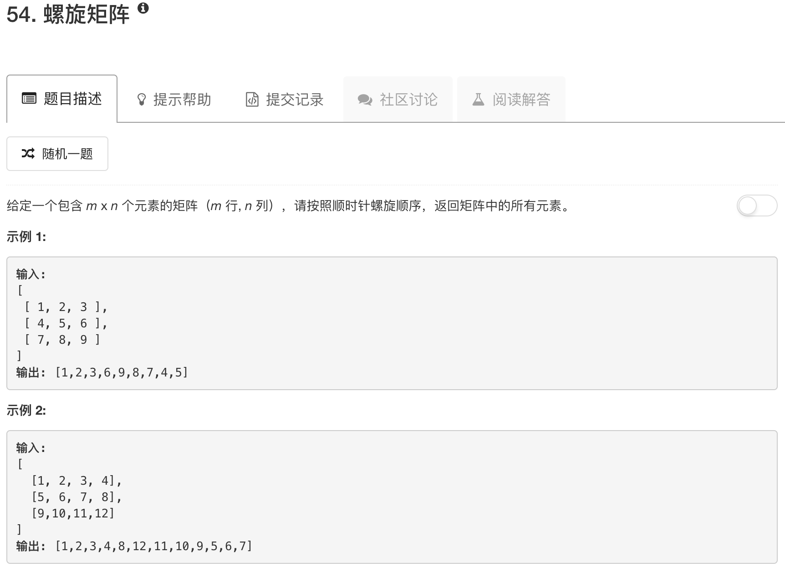

```python
class Solution(object):
    def spiralOrder(self, matrix):
        """
        :type matrix: List[List[int]]
        :rtype: List[int]
        """
        if not matrix: return []
        nrows = len(matrix)
        ncols = len(matrix[0])
        length = nrows * ncols
        
        ans = []
        
        rowsBegin = 0
        rowsEnd = nrows-1
        colsBegin = 0
        colsEnd = ncols-1
        
        while rowsBegin <= rowsEnd and colsBegin <= colsEnd:
            for jj in range(colsBegin, colsEnd+1, 1):
                ans.append(matrix[rowsBegin][jj])
            rowsBegin = rowsBegin + 1
            if rowsBegin > rowsEnd: break
            
            for jj in range(rowsBegin, rowsEnd+1, 1):
                ans.append(matrix[jj][colsEnd])
            colsEnd = colsEnd - 1
            if colsEnd < colsBegin: break
            
            for jj in range(colsEnd, colsBegin-1, -1):
                ans.append(matrix[rowsEnd][jj])
            rowsEnd = rowsEnd - 1
            if rowsEnd < rowsBegin: break
            
            for jj in range(rowsEnd, rowsBegin-1, -1):
                ans.append(matrix[jj][colsBegin])
            colsBegin = colsBegin + 1
            if colsBegin > colsEnd: break
        return ans
```

