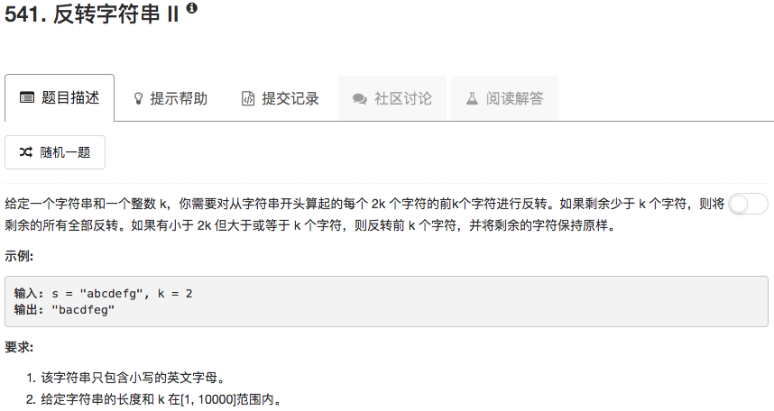

```python
class Solution(object):
    def reverseStr(self, s, k):
        """
        :type s: str
        :type k: int
        :rtype: str
        """
        if not s: return s
        strList = [x for x in s]
        nn, residual = divmod(len(strList),2*k)
        for ii in range(nn):
            tmp = strList[ii*2*k:ii*2*k+k]
            strList[ii*2*k:ii*2*k+k] = tmp[::-1]
        if nn != 0:
            if residual >= k:
                tmp = strList[(ii+1)*2*k:(ii+1)*2*k+k] 
                strList[(ii+1)*2*k:(ii+1)*2*k+k] = tmp[::-1]
            else:
                tmp = strList[(ii+1)*2*k:]
                strList[(ii+1)*2*k:] = tmp[::-1]
        elif nn == 0:
            if residual >=k:
                tmp = strList[0:k] 
                strList[0:k] = tmp[::-1]
            else:
                strList = strList[::-1]
        return ''.join(strList)
```

