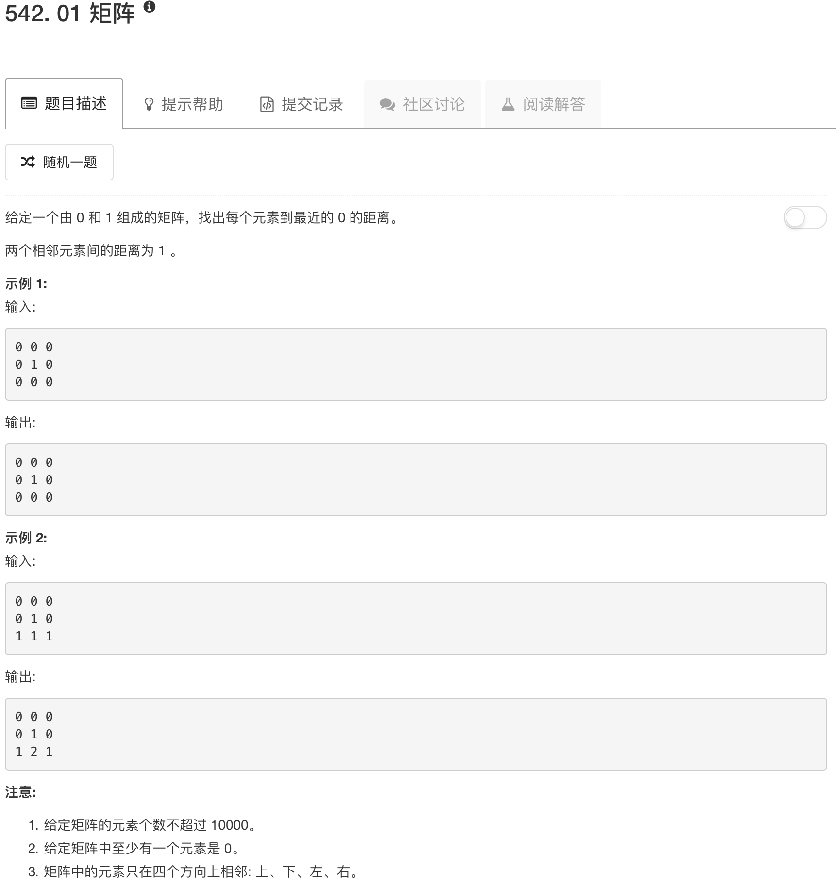

实际上就是BFS。首先，矩阵中的0元素可以认为是影响元素，1元素实际上无所谓，初始化时把1元素设置为无穷大。然后队列初始时刻都是0元素，之后比较0元素上下左右的元素，如果0元素加1，比上下左右的元素小，那么上下左右元素就加1。然后这些受影响的元素加入队列，进行循环就可以了。

```python
class Solution(object):
    def init(self, matrix, nrow, ncol):
        queue = []
        for ii in range(nrow):
            for jj in range(ncol):
                if matrix[ii][jj] == 0:
                    queue.append([ii,jj])
                else:
                    matrix[ii][jj] = float("inf")
        return queue
    
    def updateMatrix(self, matrix):
        """
        :type matrix: List[List[int]]
        :rtype: List[List[int]]
        """
        neighbors = [[0,1], [0,-1], [1,0], [-1,0]]
        nrow = len(matrix)
        ncol = len(matrix[0])
        queue = self.init(matrix, nrow, ncol)
        print matrix
        while queue:
            xx, yy = queue.pop(0)
            for neighbor in neighbors:
                xn, yn = neighbor
                xn, yn = xn+xx, yn+yy
                if not (xn < 0 or xn >= nrow or yn < 0 or yn >= ncol or matrix[xx][yy] + 1 >= matrix[xn][yn]):
                    queue.append([xn, yn])
                    matrix[xn][yn] = matrix[xx][yy] + 1
        return matrix
```

