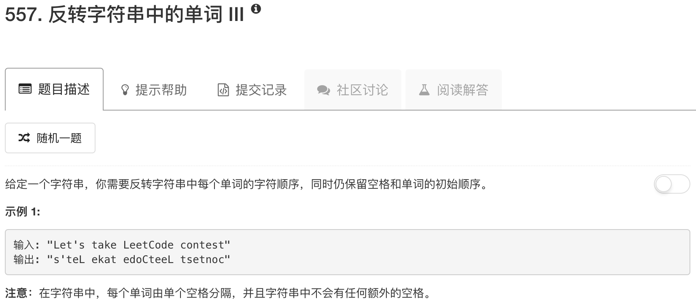

```python
class Solution(object):
    def reverseWords(self, s):
        """
        :type s: str
        :rtype: str
        """
        words = s.split()
        print words
        revWords = []
        for word in words:
            word = word[::-1]
            revWords.append(word)
        return " ".join(revWords)
```

