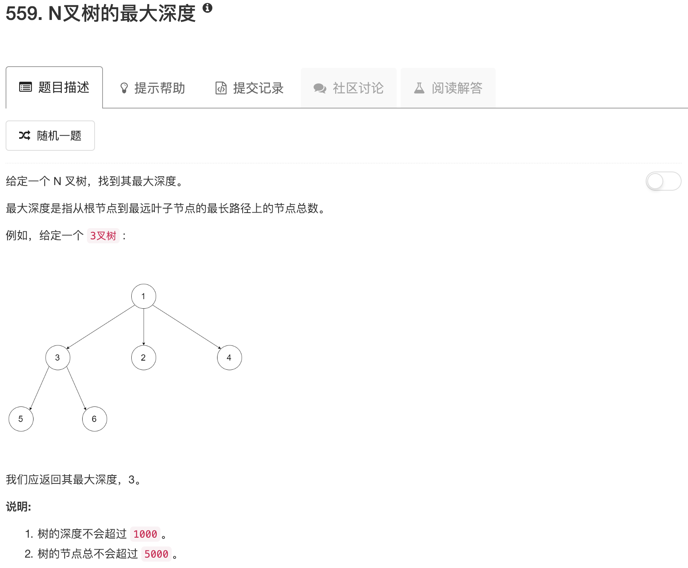

```python
"""
# Definition for a Node.
class Node(object):
    def __init__(self, val, children):
        self.val = val
        self.children = children
"""
class Solution(object):
    def maxDepth(self, root):
        """
        :type root: Node
        :rtype: int
        """
        if not root: return 0
        
        ans = [0]
        
        for node in root.children:
            tmp = self.maxDepth(node)
            ans.append(tmp)
        
        return max(ans) + 1
```

