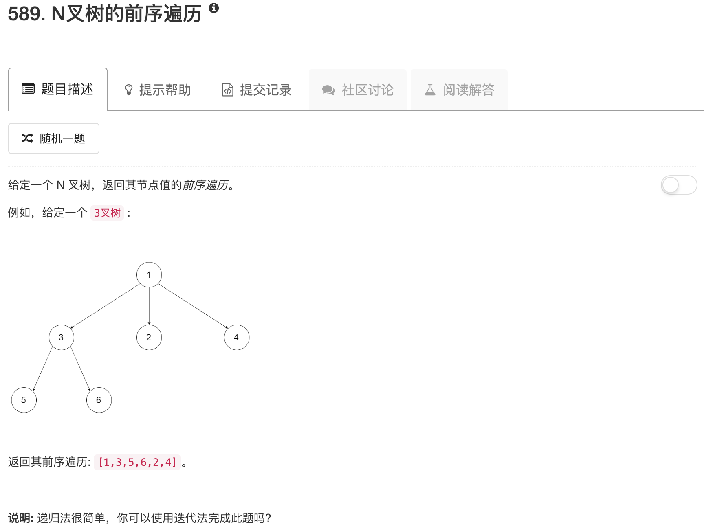

```python
"""
# Definition for a Node.
class Node(object):
    def __init__(self, val, children):
        self.val = val
        self.children = children
"""
class Solution(object):
    def preorder(self, root):
        """
        :type root: Node
        :rtype: List[int]
        """
        if not root: return []
        
        ans = [root.val]
        for node in root.children:
            tmp = self.preorder(node)
            if tmp: ans.extend(tmp)
        
        return ans
```

