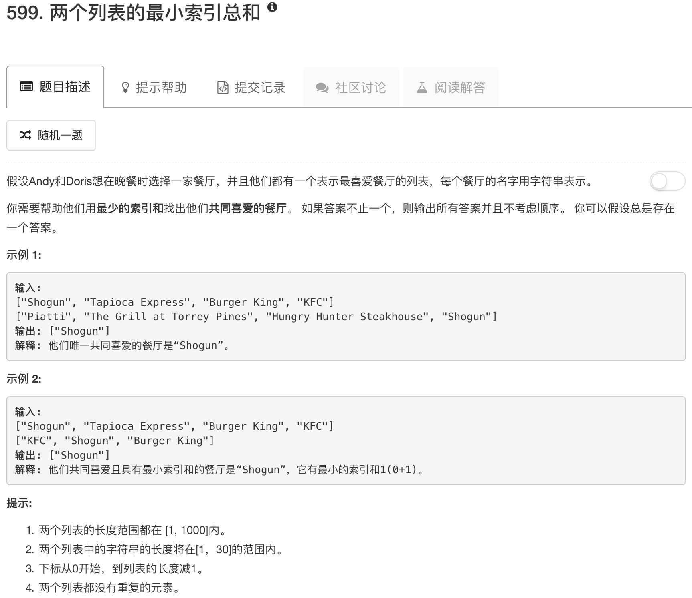

```python
class Solution(object):
    def findRestaurant(self, list1, list2):
        """
        :type list1: List[str]
        :type list2: List[str]
        :rtype: List[str]
        """
        table = {}
        
        for idx, res in enumerate(list1):
            if res in list2: table[res] = idx + list2.index(res)
        
        ans = []
        minidx = min(table.values())
        
        for res in table.keys():
            if table[res] == minidx: ans.append(res)
        
        return ans
```

