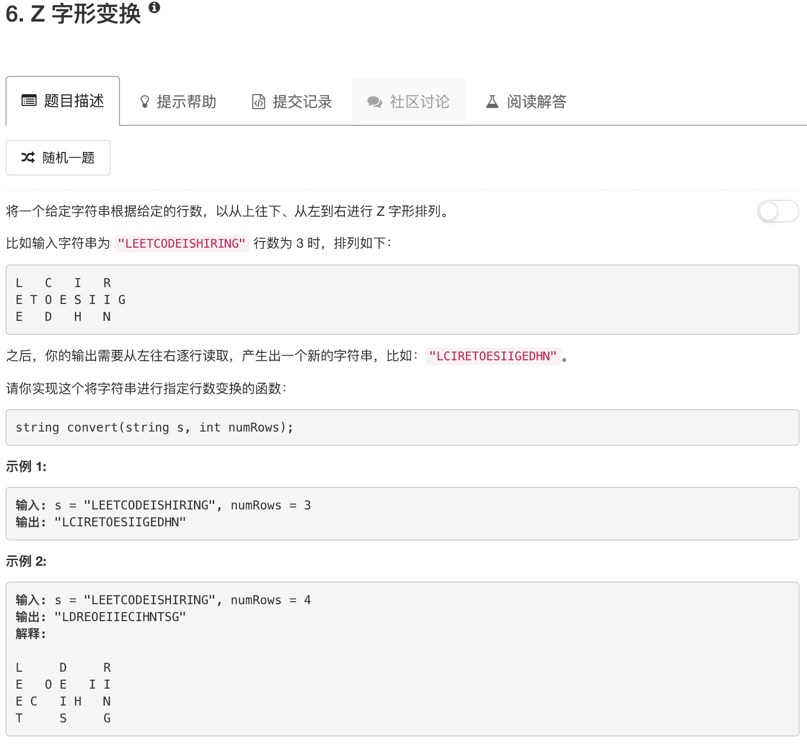

```python
class Solution:
    def convert(self, s, numRows):
        """
        :type s: str
        :type numRows: int
        :rtype: str
        """
        if numRows == 1: return s
        
        ans = ""
        gap = 2*numRows-2
        n = len(s)
        
        for row in range(numRows):
            for jj in range(0,n,gap):
                if row+jj < n: ans = ans + s[row+jj]
                if row != 0 and row != numRows -1 and jj + gap -row < n:
                    ans = ans + s[jj+gap-row]
        return ans
```

对于第一行，每个元素位于$k(2n-2)​$的位置

对于中间行（行号i），第一个元素位于$k(2n-2)+i$和$(k+1)(2n-2)-i$

对于最后一行，实际上是位于中间$k(2n-2)+n-1$

