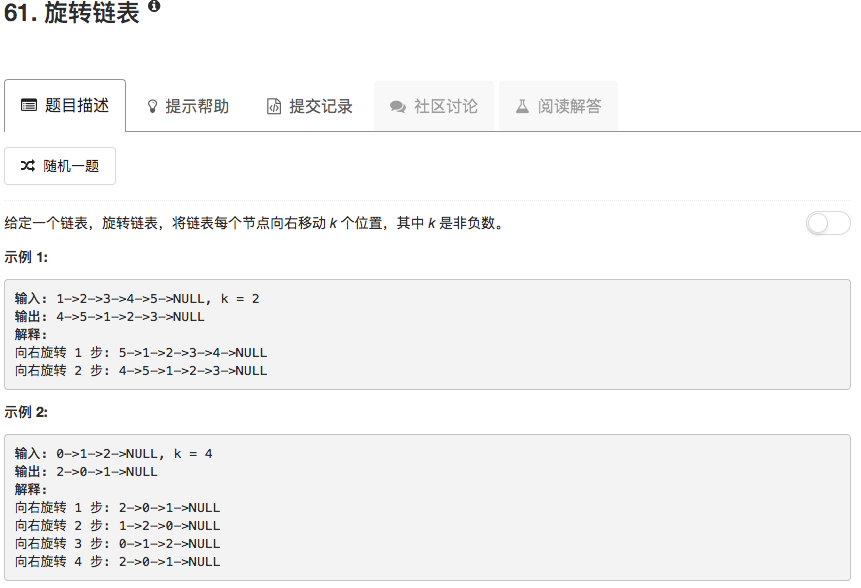

```python
# Definition for singly-linked list.
# class ListNode(object):
#     def __init__(self, x):
#         self.val = x
#         self.next = None

class Solution(object):
    def rotateRight(self, head, k):
        """
        :type head: ListNode
        :type k: int
        :rtype: ListNode
        """
        if not head: return None
        cycle = head
        count = 1
        if not cycle.next: return head
        while cycle.next.next:
            cycle = cycle.next
            count += 1
        k = k % (count + 1)
        cycle.next.next = head
        head = cycle.next
        cycle.next = None
        if k == 1: return head
        return self.rotateRight(head, k-1)
```

