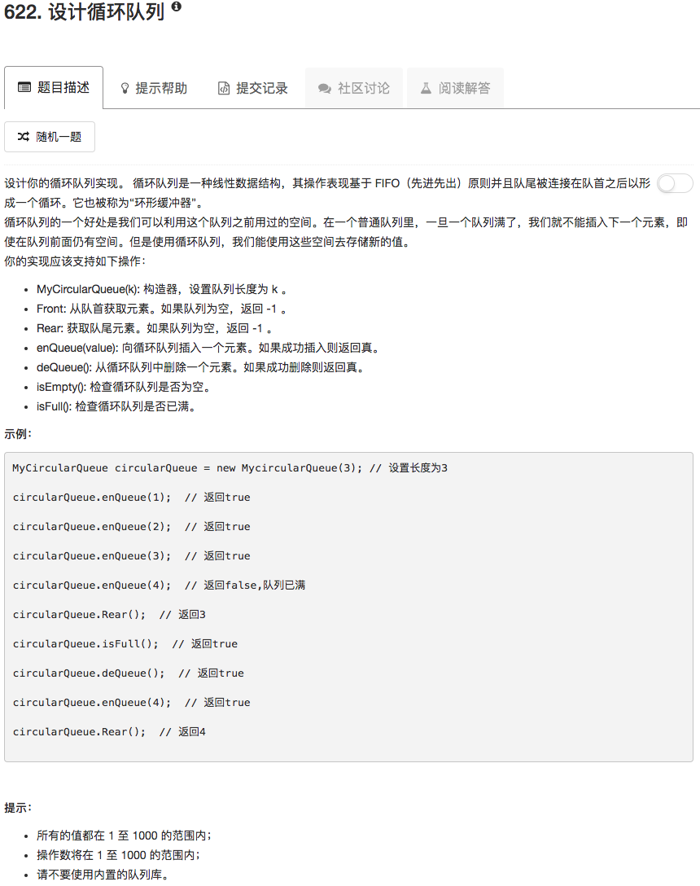

```python
class MyCircularQueue(object):

    def __init__(self, k):
        """
        Initialize your data structure here. Set the size of the queue to be k.
        :type k: int
        """
        self.size = k
        self.array = []
        

    def enQueue(self, value):
        """
        Insert an element into the circular queue. Return true if the operation is successful.
        :type value: int
        :rtype: bool
        """
        if self.isFull(): return False
        self.array.append(value)
        return True
        

    def deQueue(self):
        """
        Delete an element from the circular queue. Return true if the operation is successful.
        :rtype: bool
        """
        if self.isEmpty(): return False
        self.array.pop(0)
        return True
        

    def Front(self):
        """
        Get the front item from the queue.
        :rtype: int
        """
        if self.isEmpty(): return -1
        return self.array[0]
        

    def Rear(self):
        """
        Get the last item from the queue.
        :rtype: int
        """
        if self.isEmpty(): return -1
        return self.array[-1]
        

    def isEmpty(self):
        """
        Checks whether the circular queue is empty or not.
        :rtype: bool
        """
        return len(self.array) == 0
        

    def isFull(self):
        """
        Checks whether the circular queue is full or not.
        :rtype: bool
        """
        return len(self.array) == self.size
        


# Your MyCircularQueue object will be instantiated and called as such:
# obj = MyCircularQueue(k)
# param_1 = obj.enQueue(value)
# param_2 = obj.deQueue()
# param_3 = obj.Front()
# param_4 = obj.Rear()
# param_5 = obj.isEmpty()
# param_6 = obj.isFull()
```

