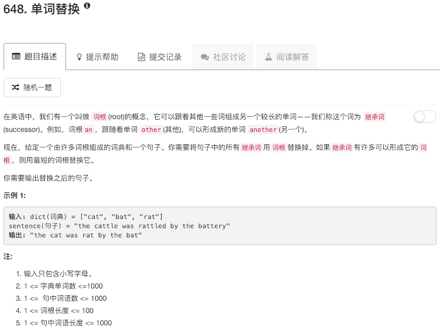

```python
class TrieNode:
    def __init__(self, val):
        self.val = val
        self.children = [None for _ in range(26)]
        self.isEnd = False

class Solution:
    def insertTrieNode(self, strs, root):
        if not strs or strs == "": return 
        for char in list(strs):
            idx = ord(char) - ord('a')
            if not root.children[idx]: root.children[idx] = TrieNode(char)
            root = root.children[idx]
        root.isEnd = True
    
    def replaceWords(self, dict, sentence):
        """
        :type dict: List[str]
        :type sentence: str
        :rtype: str
        """
        root = TrieNode(None)
        for word in dict:
            self.insertTrieNode(word,root)
        words = sentence.split(" ")
        for ii in range(len(words)):
            res = ""
            node = root
            for jj in range(len(words[ii])):
                idx = ord(words[ii][jj]) - ord("a")
                if node.children[idx]:
                    res += node.children[idx].val
                    node = node.children[idx]
                else:
                    break
                if node.isEnd:
                    words[ii] = res
                    break
        return " ".join(words)
```

