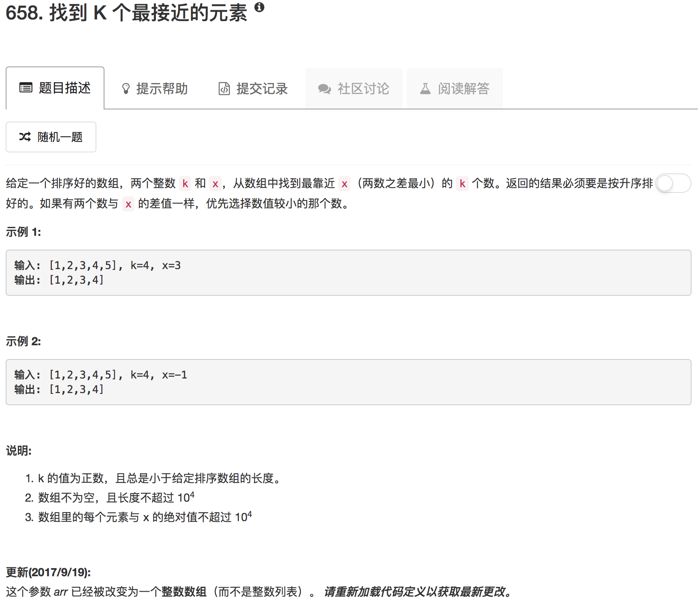

我的想法比较简单，就是先用二分查找把数组分成两半，一半小于x，另一半大于x。然后分别从中间点开始向两边查找合适的数。

```python
class Solution(object):
    def findClosestElements(self, arr, k, x):
        """
        :type arr: List[int]
        :type k: int
        :type x: int
        :rtype: List[int]
        """
        if not arr: return -1
        
        left, right, pivot = 0, len(arr) - 1, float("inf")
        
        while left <= right:
            mid = (left + right) // 2
            if arr[mid] == x:
                pivot = mid
            if arr[mid] >= x:
                right = mid - 1
            if arr[mid] <= x:
                left = mid + 1
        
        ans = []
        
        if pivot != float("inf"):
            left, right = pivot - 1, pivot + 1
            ans.append(arr[pivot])
            k = k - 1
        else:
            left, right = right, left
        
        while k:
            leftdiff, rightdiff = float("inf"),  float("inf")
            if left >= 0 and left <= len(arr) - 1: leftdiff = x - arr[left]
            if right >= 0 and right <= len(arr) - 1: rightdiff = arr[right] - x
            if rightdiff < leftdiff:
                ans.append(arr[right])
                right = right + 1
            else:
                ans.append(arr[left])
                left = left - 1
            
            k = k - 1
        
        ans.sort()
        
        return ans
```

