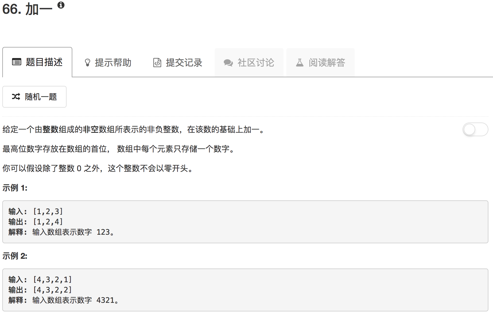

```python
class Solution(object):
    def plusOne(self, digits):
        """
        :type digits: List[int]
        :rtype: List[int]
        """
        carry = 0
        
        for ii in range(len(digits)-1,-1,-1):
            if ii == len(digits)-1:
                digits[ii] = digits[ii] + 1
            else:
                digits[ii] = digits[ii] + carry
            
            if digits[ii] // 10: 
                digits[ii] = digits[ii] % 10
                carry = 1
            else:
                carry = 0
        
        if carry:
            digits.insert(0,carry)
        
        return digits
```

