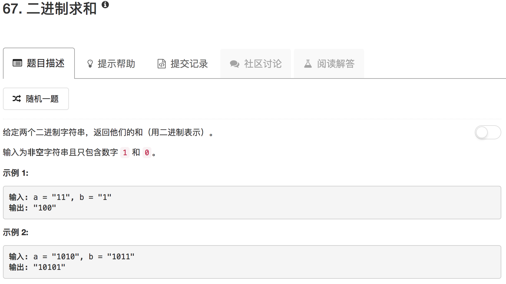

```python
class Solution(object):
    def addBinary(self, a, b):
        """
        :type a: str
        :type b: str
        :rtype: str
        """
        if not a or not b: return None
        
        longer = a if len(a) > len(b) else b
        shorter = b if len(a) > len(b) else a
        
        A = [int(x) for x in longer] 
        B = [int(x) for x in shorter] 
        
        carry = 0
        for ii in range(len(A)):
            if ii < len(B):
                A[-1-ii] = A[-1-ii] + B[len(B)-ii-1] + carry
            else:
                A[-1-ii] = A[-1-ii] + carry
            if A[-1-ii] == 2:
                carry = 1
                A[-1-ii] = '0'
            elif A[-1-ii] == 3:
                carry = 1
                A[-1-ii] = '1'
            else:
                A[-1-ii] = str(A[-1-ii])
                carry = 0
        if carry: A.insert(0,'1')
        return "".join(A)
```

