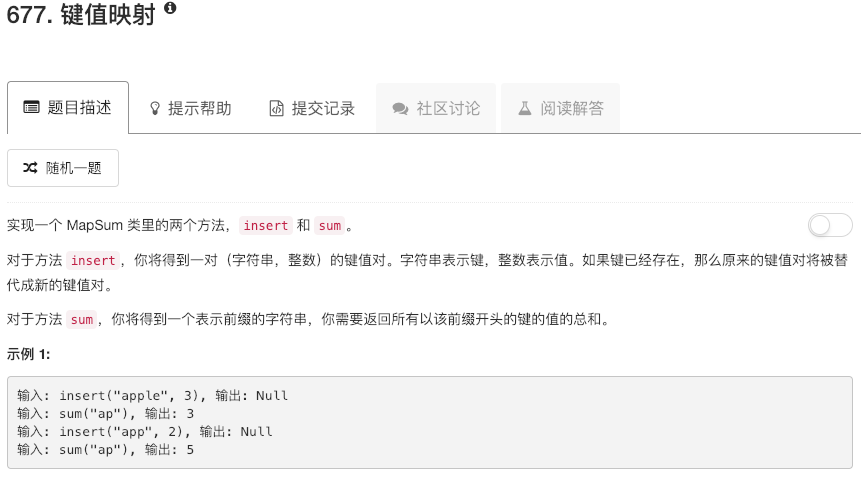

```python
class MapSum:

    def __init__(self):
        """
        Initialize your data structure here.
        """
        self.table = {}
        

    def insert(self, key, val):
        """
        :type key: str
        :type val: int
        :rtype: void
        """
        self.table[key] = val
        

    def sum(self, prefix):
        """
        :type prefix: str
        :rtype: int
        """
        print(self.table)
        ans = 0
        n = len(prefix)
        for key in self.table:
            if key[0:n] == prefix: ans += self.table[key]
        return ans


# Your MapSum object will be instantiated and called as such:
# obj = MapSum()
# obj.insert(key,val)
# param_2 = obj.sum(prefix)
```

