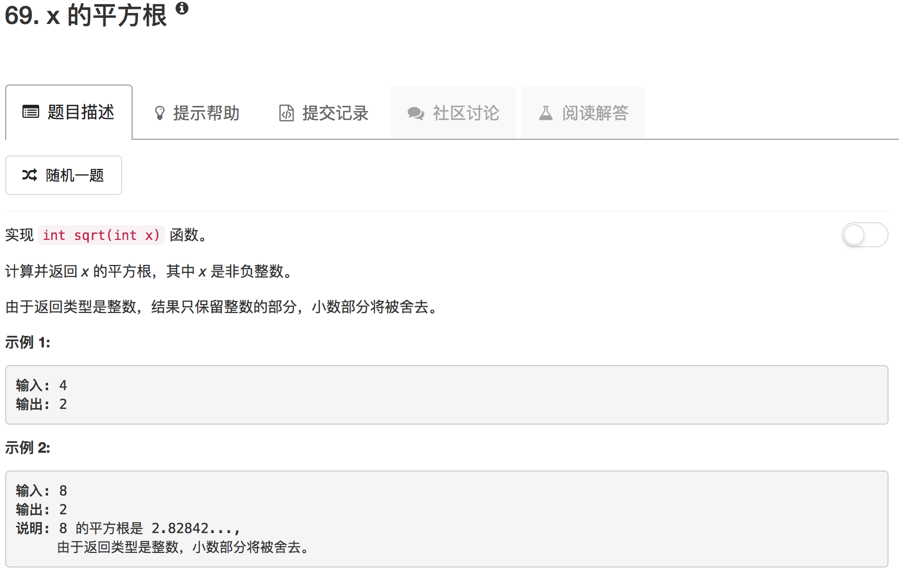

```python
class Solution(object):
    def mySqrt(self, x):
        """
        :type x: int
        :rtype: int
        """
        # using Newton's Method to solve this problem
        # f(x) = x^2 - a, we need to solve f(x) = 0
        # x = x - f(x)/f'(x) => x = (x - x/a) / 2
        ans = x
        while ans * ans > x:
            ans = (ans + x / ans) / 2
        return ans
```

