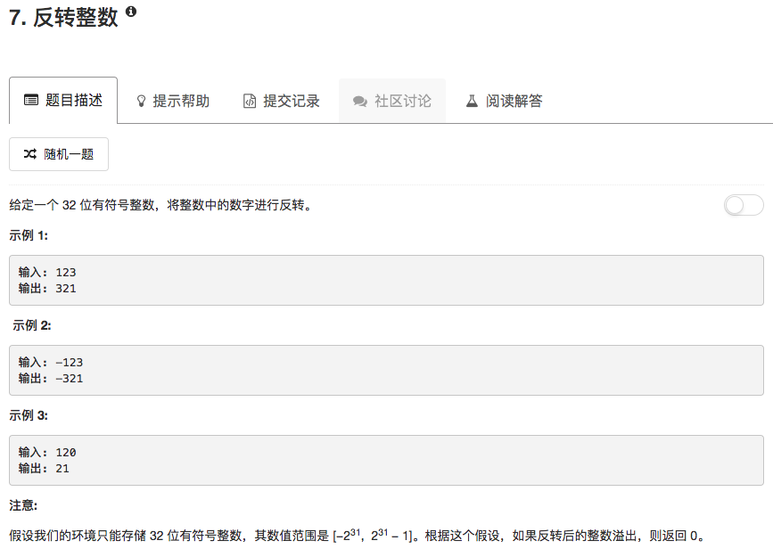

直接逐位处理就行，时间复杂度就是$O(n)$

```python
class Solution(object):
    def reverse(self, x):
        """
        :type x: int
        :rtype: int
        """
        ans = 0
        Flag = False
        if x < 0:
            Flag = True
            x = -x
        
        while x:
            digit = x % 10
            ans = ans * 10 + digit
            x = x // 10
            
        if Flag: ans = -ans
            
        if ans > 2147483647 or ans < -2147483648: ans = 0
            
        return ans
```

