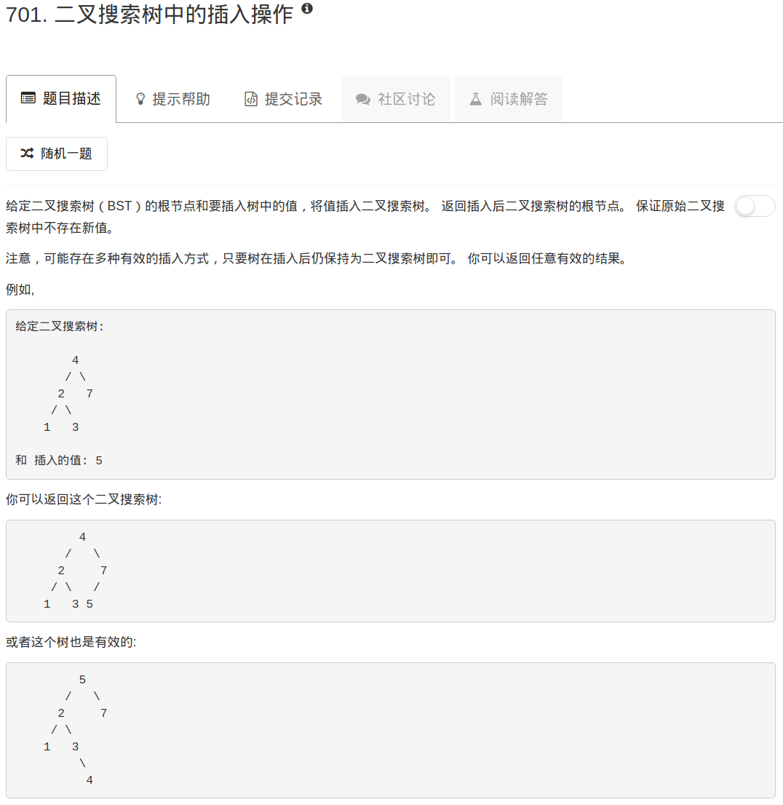

```python
# Definition for a binary tree node.
# class TreeNode:
#     def __init__(self, x):
#         self.val = x
#         self.left = None
#         self.right = None

class Solution:
    def searchBST(self, root, val):
        """
        :type root: TreeNode
        :type val: int
        :rtype: TreeNode
        """
        cur = root
        pp = root
        while cur:
            pp = cur
            if cur.val == val:
                return pp
            elif cur.val < val:
                cur = cur.right
            else:
                cur = cur.left
        return pp
    
    def insertIntoBST(self, root, val):
        """
        :type root: TreeNode
        :type val: int
        :rtype: TreeNode
        """
        pp = self.searchBST(root, val)
        if pp.val < val:
            pp.right = TreeNode(val)
        else:
            pp.left = TreeNode(val)
            
        return root
        
```

