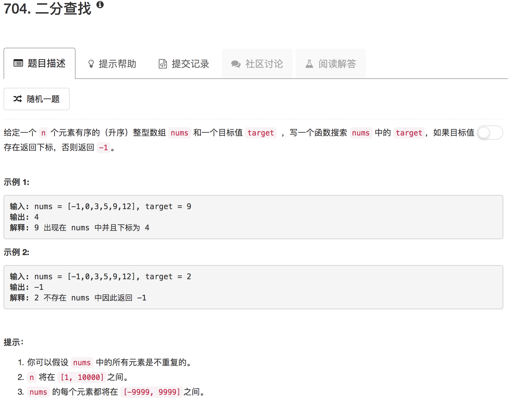

```python
class Solution(object):
    def binarySearch(self, nums, low, high, target):
        if low == high:
            return -1 if nums[low] != target else low
        
        mid = (low + high) // 2
        if nums[mid] == target: return mid
        xx, yy = [low, mid] if nums[mid] > target else [mid+1, high]
        return self.binarySearch(nums, xx, yy, target) 
    
    def search(self, nums, target):
        """
        :type nums: List[int]
        :type target: int
        :rtype: int
        """
        return self.binarySearch(nums, 0, len(nums)-1, target)      
```

