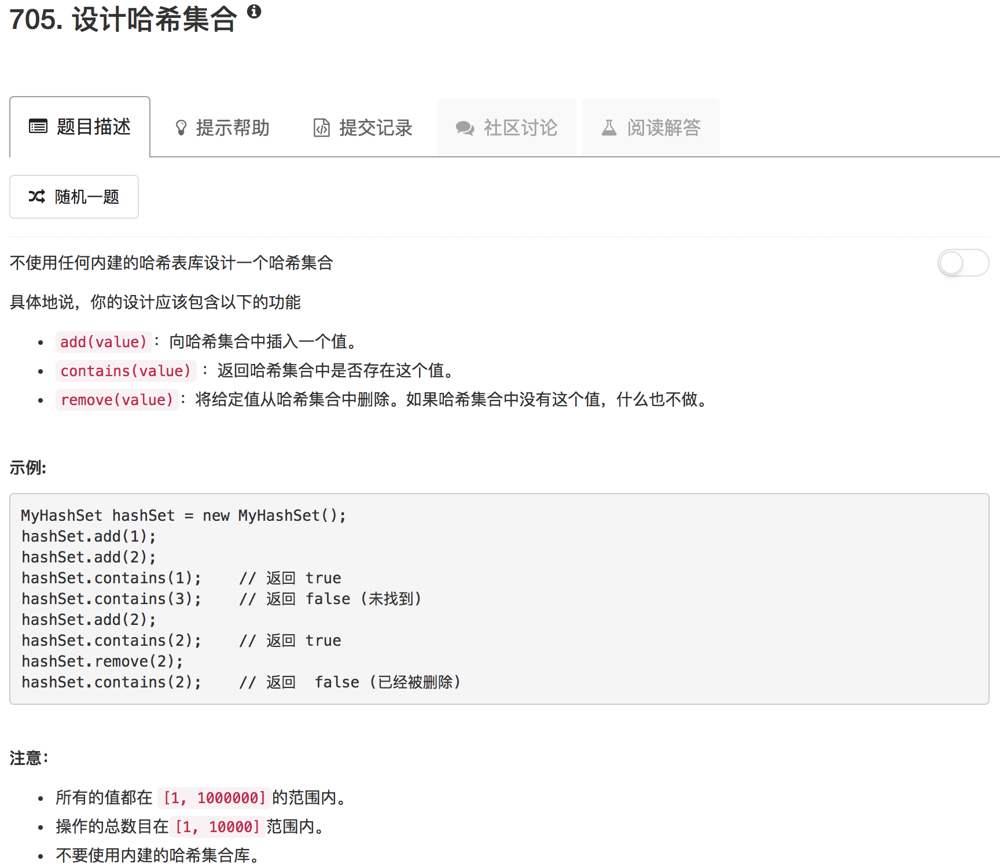

```python
class MyHashSet(object):

    def __init__(self):
        """
        Initialize your data structure here.
        """
        self.hashSet = []

    def add(self, key):
        """
        :type key: int
        :rtype: void
        """
        if not self.contains(key):
            self.hashSet.append(key)

    def remove(self, key):
        """
        :type key: int
        :rtype: void
        """
        if key in self.hashSet:
            self.hashSet.remove(key)

    def contains(self, key):
        """
        Returns true if this set did not already contain the specified element
        :type key: int
        :rtype: bool
        """
        return True if key in self.hashSet else False


# Your MyHashSet object will be instantiated and called as such:
# obj = MyHashSet()
# obj.add(key)
# obj.remove(key)
# param_3 = obj.contains(key)
```

