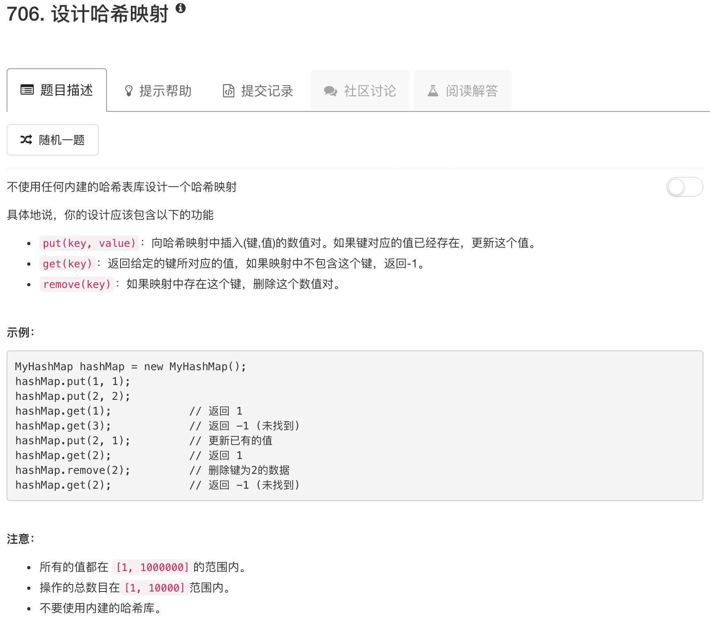

```python
class MyHashMap(object):

    def __init__(self):
        """
        Initialize your data structure here.
        """
        self.hash = [-1] * 1000001
        

    def put(self, key, value):
        """
        value will always be positive.
        :type key: int
        :type value: int
        :rtype: void
        """
        self.hash[key] = value
        

    def get(self, key):
        """
        Returns the value to which the specified key is mapped, or -1 if this map contains no mapping for the key
        :type key: int
        :rtype: int
        """
        return self.hash[key]
        

    def remove(self, key):
        """
        Removes the mapping of the specified value key if this map contains a mapping for the key
        :type key: int
        :rtype: void
        """
        self.hash[key] = -1


# Your MyHashMap object will be instantiated and called as such:
# obj = MyHashMap()
# obj.put(key,value)
# param_2 = obj.get(key)
# obj.remove(key)
```

