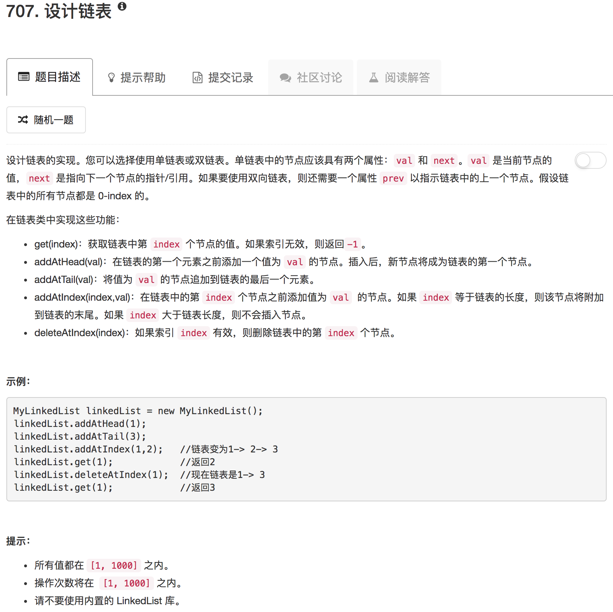

```python
class Node:
    def __init__(self, value):
        """
        Doubly linked list
        """
        self.val = value
        self.next = None
        self.prev = None
        
class MyLinkedList(object):

    def __init__(self):
        """
        Initialize your data structure here.
        """
        self.head = Node(-1)
        self.tail = Node(-1)
        self.head.next = self.tail
        self.tail.prev = self.head
        self.size = 0
        
    def add(self, prevNode, val):
        node = Node(val)
        node.prev = prevNode
        node.next = prevNode.next
        node.prev.next = node
        node.next.prev = node
        self.size += 1
        print(self.size)
    
    def delete(self, Node):
        Node.prev.next = Node.next
        Node.next.prev = Node.prev
        self.size -= 1
        
    def forward(self, start, end, curr):
        while start != end:
            start += 1
            curr = curr.next
        return curr
    
    def backward(self, start, end, curr):
        while start != end:
            start -= 1
            curr = curr.prev
        return curr

    def get(self, index):
        """
        Get the value of the index-th node in the linked list. If the index is invalid, return -1.
        :type index: int
        :rtype: int
        """
        if 0 <= index <= self.size // 2:
            return self.forward(0, index, self.head.next).val
        elif self.size // 2 < index < self.size:
            return self.backward(self.size-1, index, self.tail.prev).val
        print(self.size)
        return -1
            
    def addAtHead(self, val):
        """
        Add a node of value val before the first element of the linked list. After the insertion, the new node will be the first node of the linked list.
        :type val: int
        :rtype: void
        """
        self.add(self.head, val)
        
    def addAtTail(self, val):
        """
        Append a node of value val to the last element of the linked list.
        :type val: int
        :rtype: void
        """
        self.add(self.tail.prev, val)

    def addAtIndex(self, index, val):
        """
        Add a node of value val before the index-th node in the linked list. If index equals to the length of linked list, the node will be appended to the end of linked list. If index is greater than the length, the node will not be inserted.
        :type index: int
        :type val: int
        :rtype: void
        """
        if 0 <= index <= self.size // 2:
            curr = self.forward(0, index, self.head.next).prev
            self.add(curr, val)
        elif self.size // 2 < index <= self.size:
            curr = self.backward(self.size, index, self.tail).prev
            self.add(curr, val)
        
    def deleteAtIndex(self, index):
        """
        Delete the index-th node in the linked list, if the index is valid.
        :type index: int
        :rtype: void
        """
        if 0 <= index <= self.size // 2:
            curr = self.forward(0, index, self.head.next)
            self.delete(curr)
        elif self.size // 2 < index < self.size:
            curr = self.backward(self.size-1, index, self.tail.prev)
            self.delete(curr)
        
# Your MyLinkedList object will be instantiated and called as such:
# obj = MyLinkedList()
# param_1 = obj.get(index)
# obj.addAtHead(val)
# obj.addAtTail(val)
# obj.addAtIndex(index,val)
# obj.deleteAtIndex(index)
```

