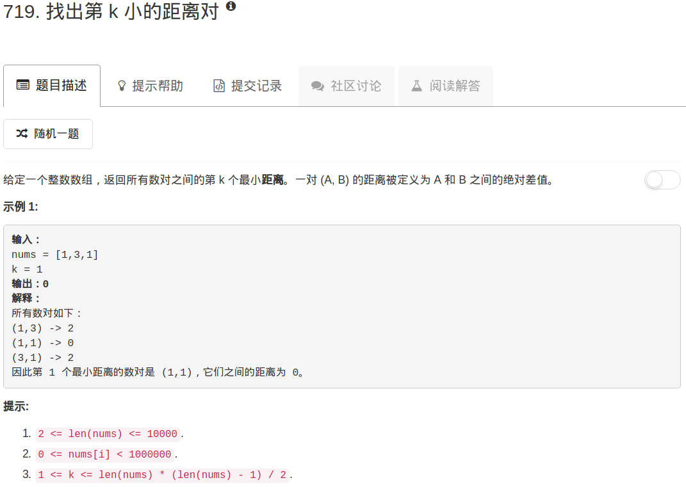

```python
class Solution:
    def smallestDistancePair(self, nums, k):
        """
        :type nums: List[int]
        :type k: int
        :rtype: int
        """
        searchTable = [0 for x in range(1000000)]
        n = len(nums)
        
        for ii in range(n-1):
            for jj in range(ii+1,n):
                searchTable[abs(nums[ii]-nums[jj])]+=1
        
        for ii in range(1000000):
            if searchTable[ii] >= k:
                return ii
            k -= searchTable[ii]
        return -1
```

这种解法很费时，leetcode官网给出的解答里，有一个是不用二分查找的

```python
class Solution(object):
    def smallestDistancePair(self, nums, k):
        nums.sort()
        heap = [(nums[i+1] - nums[i], i, i+1)
                for i in xrange(len(nums) - 1)]
        heapq.heapify(heap)

        for _ in xrange(k):
            d, root, nei = heapq.heappop(heap)
            if nei + 1 < len(nums):
                heapq.heappush((nums[nei + 1] - nums[root], root, nei + 1))

        return d
```

**Intuition and Algorithm**

Sort the points. For every point with index `i`, the pairs with indexes `(i, j)` [by order of distance] are `(i, i+1), (i, i+2), ..., (i, N-1)`.

Let's keep a heap of pairs, initially `heap = [(i, i+1) for all i]`, and ordered by distance (the distance of `(i, j)` is `nums[j] - nums[i]`.) Whenever we use a pair `(i, x)` from our heap, we will add `(i, x+1)` to our heap when appropriate.