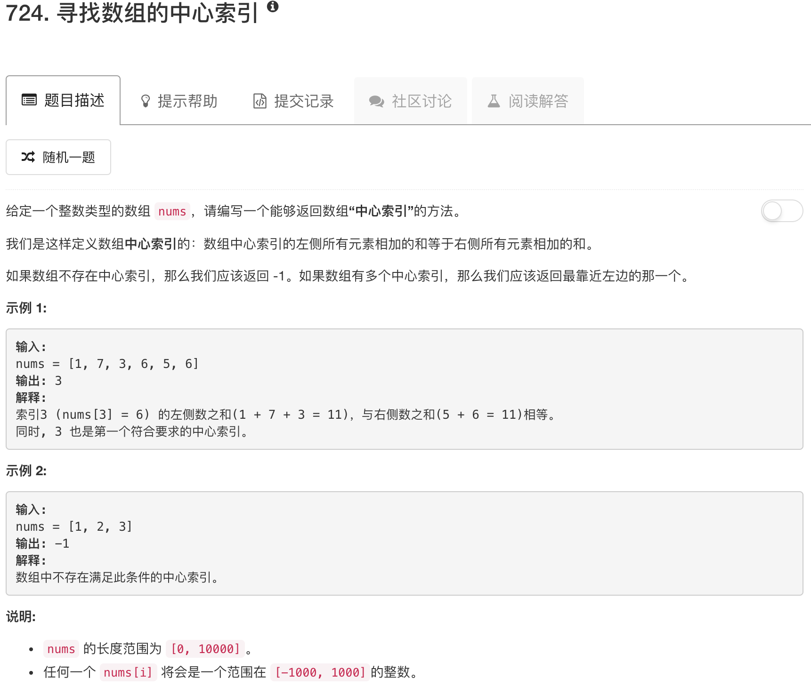

```python
class Solution(object):
    def pivotIndex(self, nums):
        """
        :type nums: List[int]
        :rtype: int
        """  
        res = sum(nums)
        leftsum = 0
        for idx, num in enumerate(nums):
            if leftsum * 2 + num == res:
                return idx
            leftsum += num
        return -1
```

