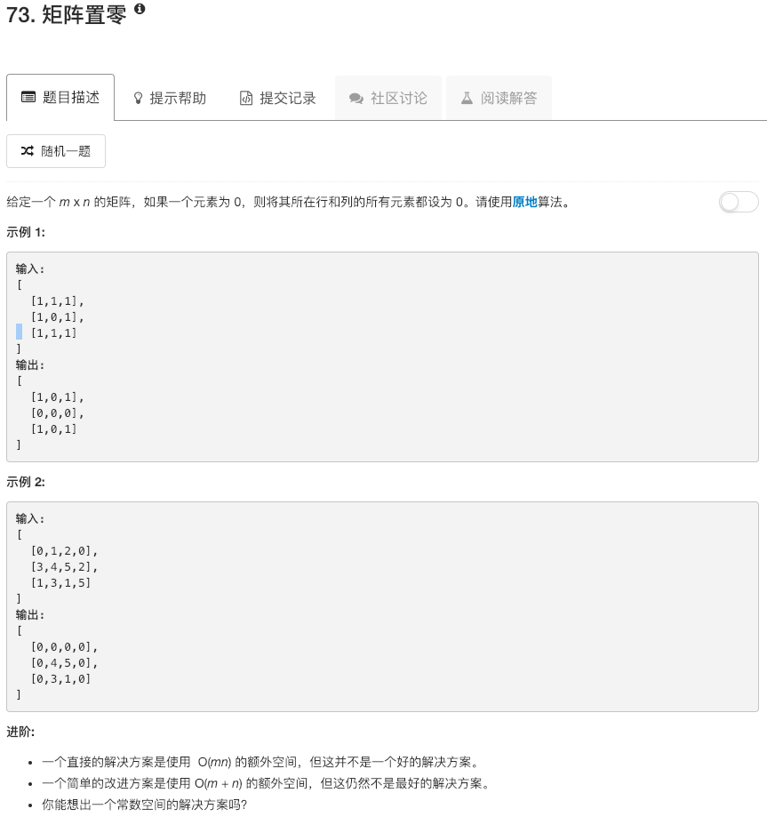

```python
class Solution:
    def setZeroes(self, matrix):
        """
        :type matrix: List[List[int]]
        :rtype: void Do not return anything, modify matrix in-place instead.
        """
        search = []
        for ii in range(len(matrix)):
            for jj in range(len(matrix[0])):
                if matrix[ii][jj] == 0: search.append([ii,jj])
        for ii, jj in search:
            matrix[ii] = [0] * len(matrix[ii])
            for kk in range(len(matrix)):
                matrix[kk][jj] = 0
```

