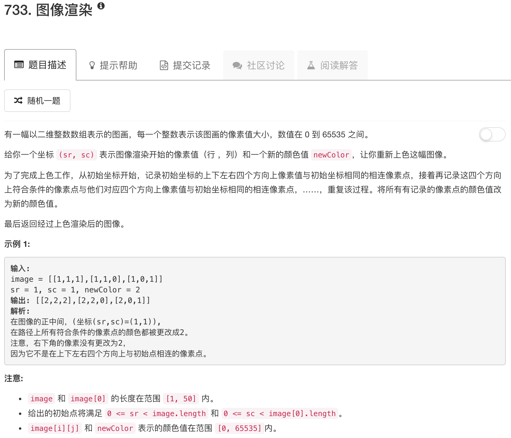

```python
class Solution(object):
    def dfs(self, image, sr, sc, nrow, ncol, oldColor, newColor):
        if sr < 0 or sr >= nrow or sc < 0 or sc >= ncol: return
        if image[sr][sc] == oldColor:
            image[sr][sc] = newColor
            self.dfs(image, sr-1, sc, nrow, ncol, oldColor, newColor)
            self.dfs(image, sr+1, sc, nrow, ncol, oldColor, newColor)
            self.dfs(image, sr, sc+1, nrow, ncol, oldColor, newColor)
            self.dfs(image, sr, sc-1, nrow, ncol, oldColor, newColor)
        
    
    def floodFill(self, image, sr, sc, newColor):
        """
        :type image: List[List[int]]
        :type sr: int
        :type sc: int
        :type newColor: int
        :rtype: List[List[int]]
        """
        nrow = len(image)
        ncol = len(image[0])
        oldColor = image[sr][sc]
        if oldColor != newColor:
            self.dfs(image, sr, sc, nrow, ncol, oldColor, newColor)
        return image
```

