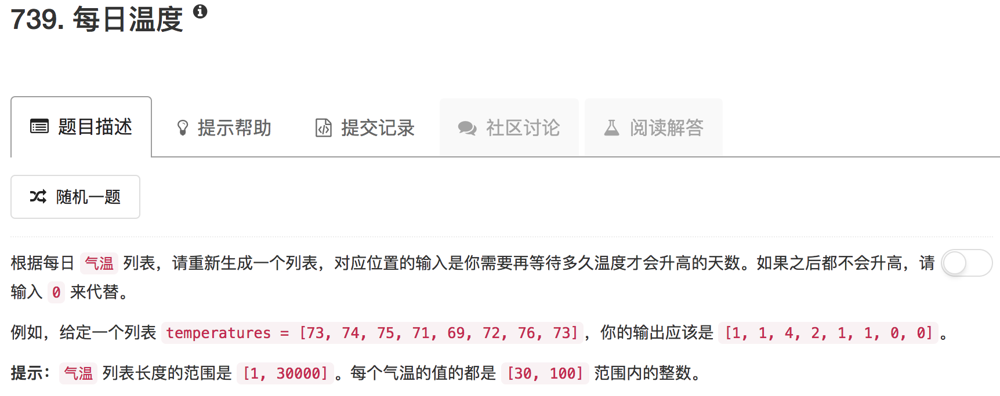

```python
class Solution(object):
    def dailyTemperatures(self, temperatures):
        """
        :type temperatures: List[int]
        :rtype: List[int]
        """
        ans = [0] * len(temperatures)
        stack = []
        for ii in range(len(temperatures)-1,-1,-1):
            while stack and temperatures[ii] >= temperatures[stack[-1]]:
                stack.pop()
            if stack: ans[ii] = stack[-1] - ii
            stack.append(ii)
        return ans
```

