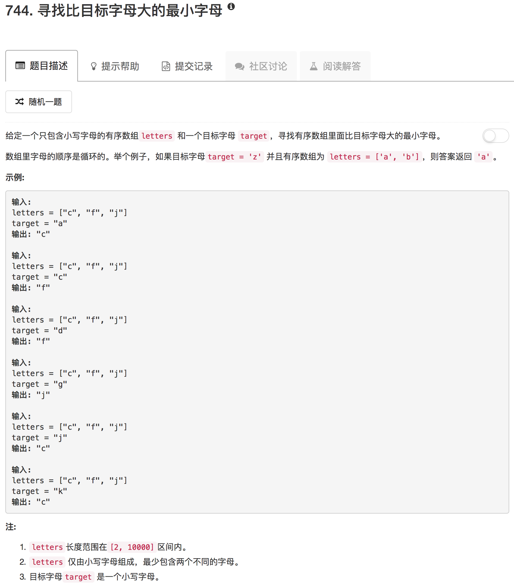

这道题考察的二分查找。这里顺路记录下这种二分查找的思路。这种二分查找，左边设置为数组起点，右边设置为数组长度加一，然后循环条件是left<right，当left=right时停止循环。

循环体内可以有一定的变化。如果当中间值大于目标值，right=mid，其他情况设置为left=mid+1，这样最终结束时得到的就是大于等于目标值的元素。而如果循环中设置当中间值大于目标值，right=mid-1，其他情况为left=mid，这样得到的就是小于等于目标值的元素。当数组中有重复元素时，例如，数组形为`[e,e,e,e,n,n,n,n]`，对于第一种方法，循环结束得到的是left为数组长度加一，而第二种方法得到的是第一个元素，即left为0

```python
class Solution(object):
    def nextGreatestLetter(self, letters, target):
        """
        :type letters: List[str]
        :type target: str
        :rtype: str
        """
        left, right = 0, len(letters)
        
        while left < right:
            mid = (left + right) // 2
            if letters[mid] > target:
                right = mid
            else:
                left = mid + 1

        return letters[left%len(letters)]
```

