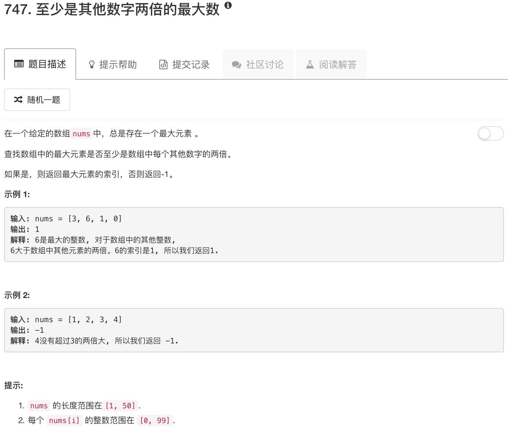

```python
class Solution(object):
    def dominantIndex(self, nums):
        """
        :type nums: List[int]
        :rtype: int
        """
        maximum = max(nums)
        ans = 0
        for idx, num in enumerate(nums):
            if maximum != num and maximum < 2*num: return -1
            if maximum == num: ans = idx
        return ans
```