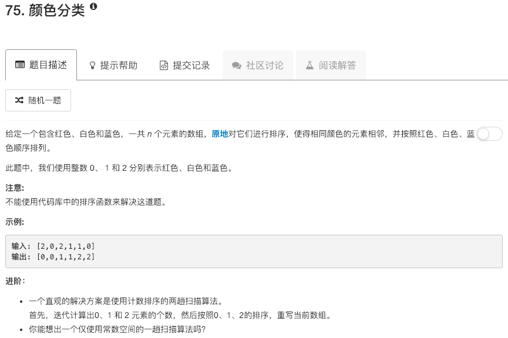

```python
class Solution:
    def swap(self, idx, idy, nums):
        tmp = nums[idx]
        nums[idx] = nums[idy]
        nums[idy] = tmp
    
    def sortColors(self, nums):
        """
        :type nums: List[int]
        :rtype: void Do not return anything, modify nums in-place instead.
        """
        n = len(nums)
        left = 0
        right = n-1
        p = 0
        
        while p <= right:
            if nums[p] == 0 and p == left:
                self.swap(p, left, nums)
                left += 1
                p += 1
            elif nums[p] == 0 and p != left:
                self.swap(p, left, nums)
                left += 1
            elif nums[p] == 2:
                self.swap(p, right, nums)
                right -= 1
            else:
                p += 1
```

