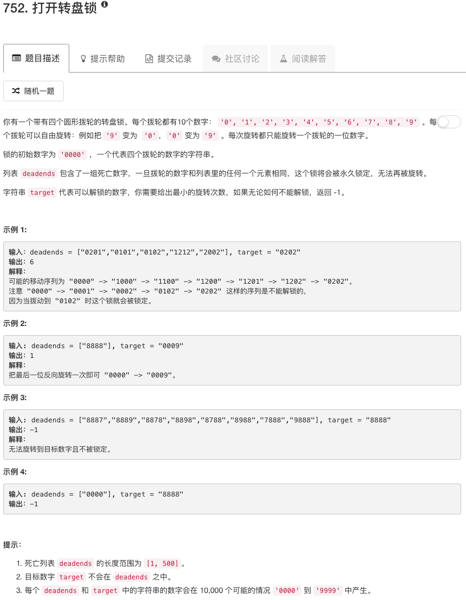

第一次写的时候超时了，这里有个小技巧要注意下。在Python中，搜索list和搜索set的速度是不一样的，搜索set要快很多，所以当我把visited集合从list变成set，就通过了。

```python
class Solution(object):
    def getNeighbour(self, curr):
        ans = []
        for ii in range(len(curr)):
            neighbour1 = list(curr)
            neighbour2 = list(curr)
            digit1 = (int(curr[ii])+1) % 10
            digit2 = (int(curr[ii])-1) % 10
            neighbour1[ii] = str(digit1)
            neighbour2[ii] = str(digit2)
            ans.append("".join(neighbour1))
            ans.append("".join(neighbour2))
        return ans
        
    def openLock(self, deadends, target):
        """
        :type deadends: List[str]
        :type target: str
        :rtype: int
        """
        init = "0000"
        if target in deadends or init in deadends: return -1
        
        count = 0
        queue = [init]
        visited = set(deadends)
        neighbourList = []
        
        while queue:
            curr = queue.pop(0)
            
            if curr == target: return count
            
            neighbours = self.getNeighbour(curr)
             
            for neighbour in neighbours:
                if not neighbour in visited:
                    visited.add(neighbour)
                    neighbourList.append(neighbour)

            if not queue:
                count = count + 1
                queue = neighbourList
                neighbourList = []
        return -1
```

