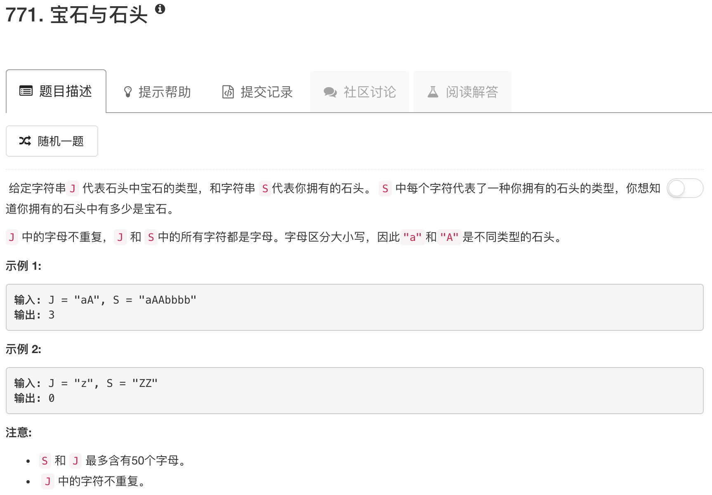

```python
class Solution(object):
    def numJewelsInStones(self, J, S):
        """
        :type J: str
        :type S: str
        :rtype: int
        """
        JList = list(J)
        SList = list(S)
        count = 0
        for stone in SList:
            if stone in JList: count = count + 1
        return count
```

