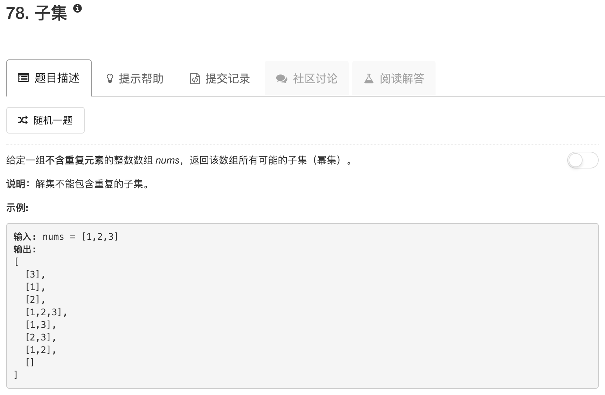

```python
import copy
class Solution:
    def subsets(self, nums):
        """
        :type nums: List[int]
        :rtype: List[List[int]]
        """
        ans = [[]]
        for num in nums:
            tmp = copy.deepcopy(ans)
            for ii in range(len(tmp)):
                tmp[ii].append(num)
            ans.extend(tmp)
        return ans
```

这道题的思路，其实就是一个数字一个数字往里填。

最开始的时候，ans里面只有空集。然后看第一个数字。把第一个数字增加到空集里，和之前的空集一起组成新的ans。然后就这样循环每个数字，最后就得到了所求的。这里空集的使用是关键。