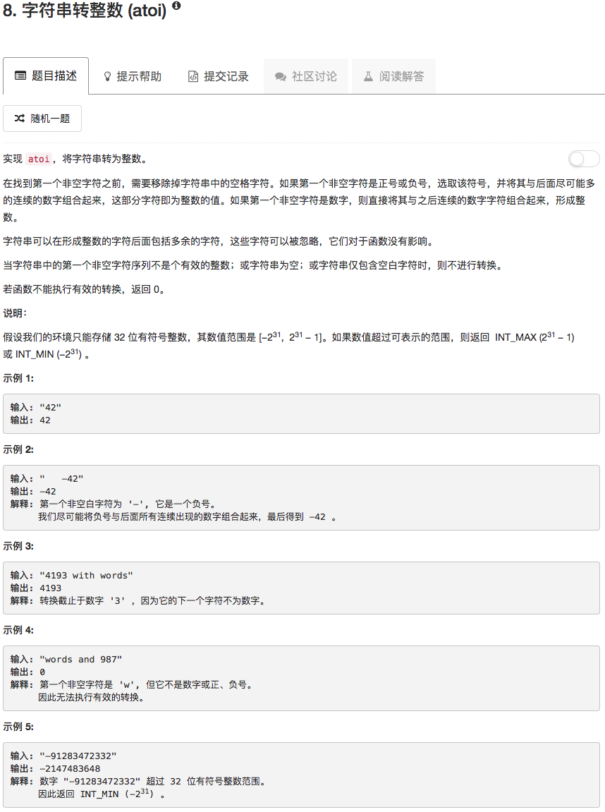

```python
class Solution(object):
    def myAtoi(self, str):
        """
        :type str: str
        :rtype: int
        """
        if not str: return 0
        
        INT_MIN = -2147483648
        INT_MAX = 2147483647
        
        start = -1
        end = -1
        table = ['0','1','2','3','4','5','6','7','8','9']
        sign = ['+','-']
        
        first = 0
        while first < len(str):
            if str[first] != " ": break
            first += 1
        if first == len(str): return 0
        
        if str[first] not in table and str[first] not in sign: return 0
        if str[first] in sign and (first == len(str)-1 or str[first+1] not in table): return 0
        
        for ii in range(len(str)):
            if start == -1 and str[ii] in table:
                start = ii
            if start != -1 and str[ii] not in table and end == -1:
                end = ii-1
        if start != -1 and end == -1: end = len(str)-1
        ans = int(str[start:end+1])
        if str[first] == '-': ans = -ans
        if ans < INT_MIN: return INT_MIN
        if ans > INT_MAX: return INT_MAX
        return ans
```

