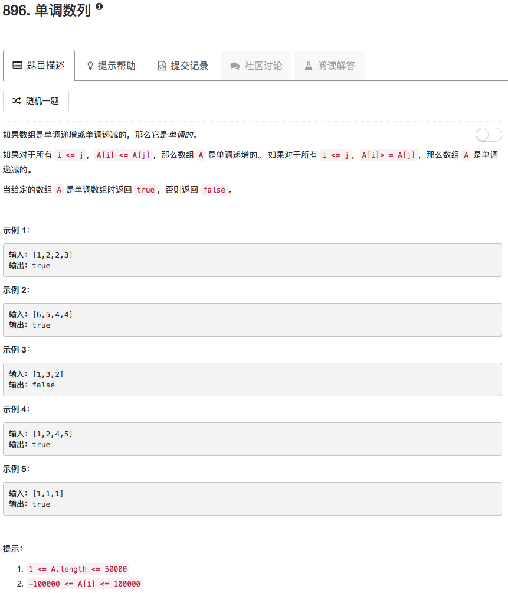

```python
class Solution(object):
    def isMonotonic(self, A):
        """
        :type A: List[int]
        :rtype: bool
        """
        if len(A) == 1: return True
        
        tmp = A[0]
        monoIncrease = True
        monoDecrease = True
        
        tmp = A[0]
        for ii in range(1,len(A)):
            if A[ii] >= tmp:
                tmp = A[ii]
            else:
                monoIncrease = False
        
        tmp = A[0]
        for ii in range(1,len(A)):
            if A[ii] <= tmp:
                tmp = A[ii]
            else:
                monoDecrease = False
        
        return monoIncrease or monoDecrease
```

