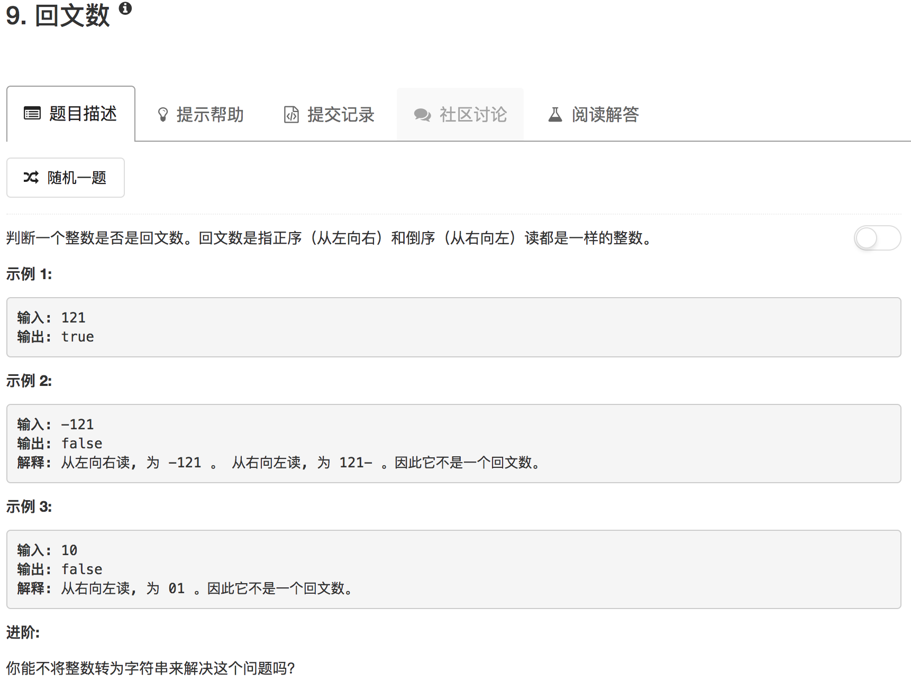

```python
class Solution(object):
    def isPalindrome(self, x):
        """
        :type x: int
        :rtype: bool
        """
        if x < 0: return False
        
        xx = x
        tmp = 0
        while x:
            last = x % 10
            tmp = tmp * 10 + last
            x = x // 10
        if xx == tmp:
            return True
        return False
```

