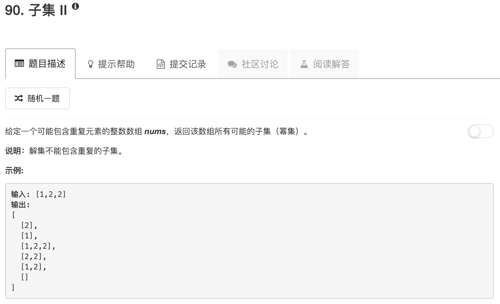

```python
import copy
class Solution:
    def subsetsWithDup(self, nums):
        """
        :type nums: List[int]
        :rtype: List[List[int]]
        """
        ans = [[]]
        for num in nums:
            tmp = copy.deepcopy(ans)
            for ii in range(len(tmp)):
                tmp[ii].append(num)
            ans.extend(tmp)
        res = []
        for elem in ans:
            elem.sort()
            if elem not in res: res.append(elem)
        return res
```

这道题其实就是在第78题的基础上，再增加一次判断。