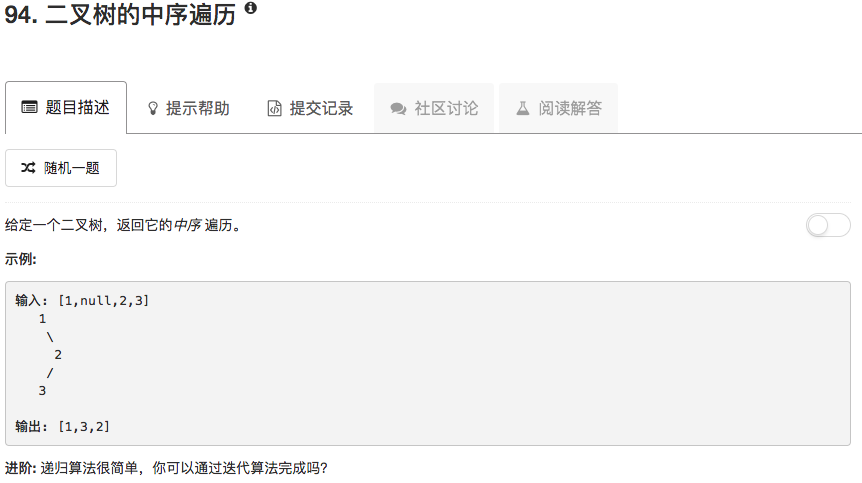

```python
# Definition for a binary tree node.
# class TreeNode(object):
#     def __init__(self, x):
#         self.val = x
#         self.left = None
#         self.right = None

class Solution(object):
    def inorderTraversal(self, root):
        """
        :type root: TreeNode
        :rtype: List[int]
        """
        if root == None:
            return []
        
        ans = []
        
        left = self.inorderTraversal(root.left)
        if left != None: ans.extend(left)
        
        ans.append(root.val)
        
        right = self.inorderTraversal(root.right)
        if right != None: ans.extend(right)
            
        return ans
```

