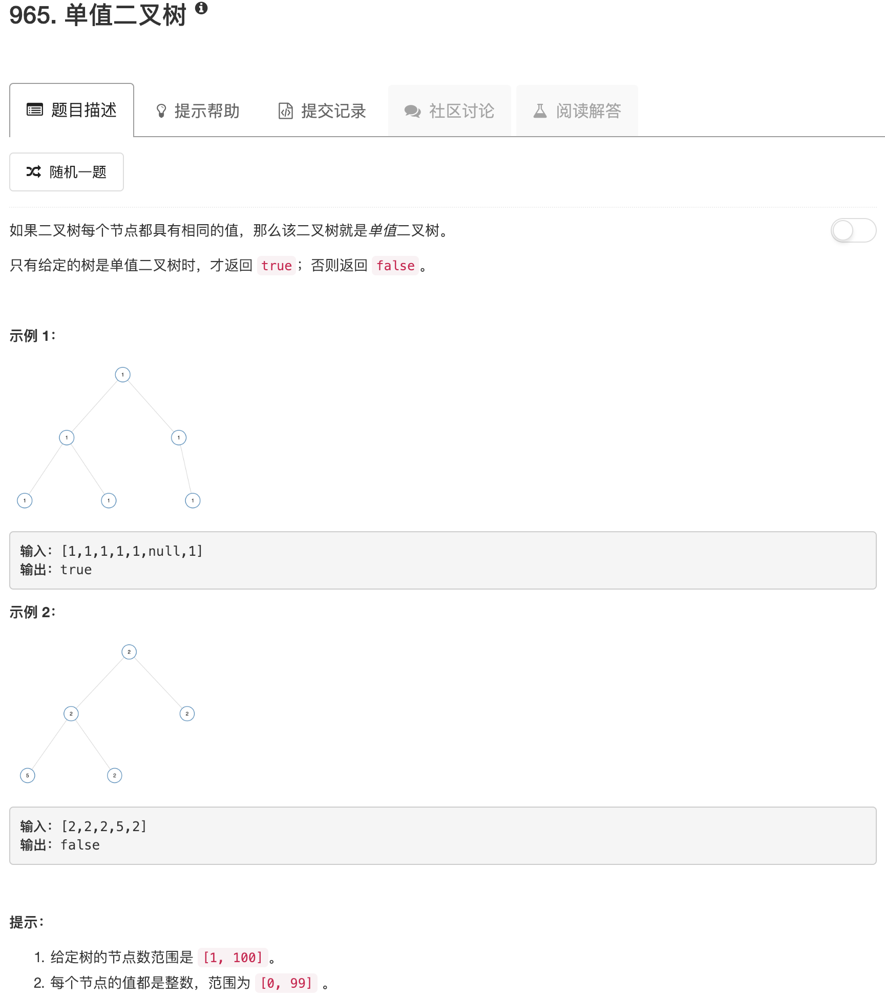

```python
# Definition for a binary tree node.
# class TreeNode:
#     def __init__(self, x):
#         self.val = x
#         self.left = None
#         self.right = None

class Solution:
    def preorder(self, root):
        if not root: return 
        
        ans = [root.val]
        
        if root.left: ans.extend(self.preorder(root.left))
        if root.right: ans.extend(self.preorder(root.right))
        
        return ans
        
    def isUnivalTree(self, root):
        """
        :type root: TreeNode
        :rtype: bool
        """
        return True if len(set(self.preorder(root))) == 1 else False
```

